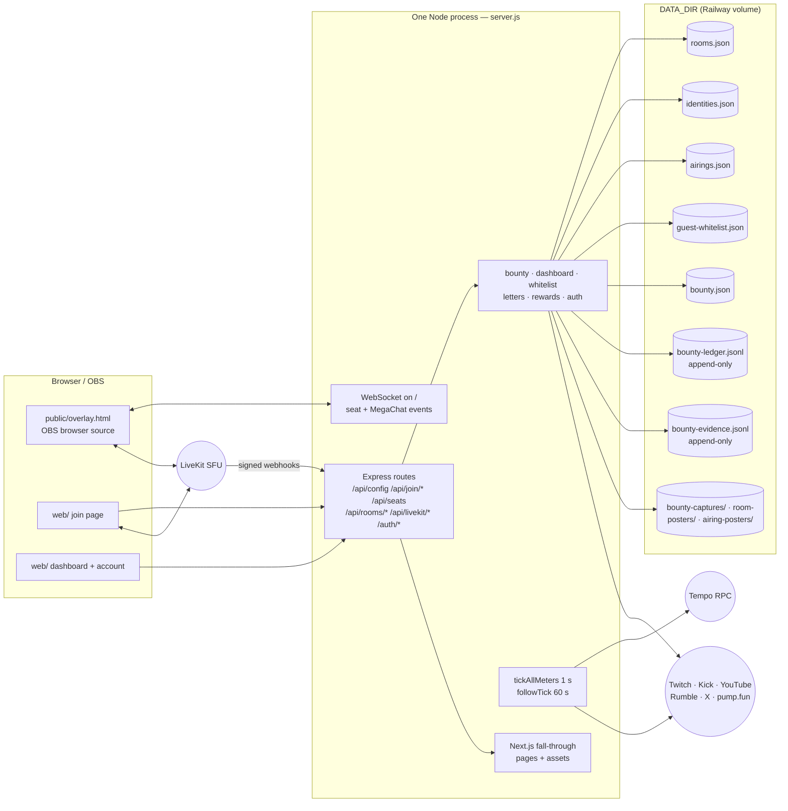

# Architecture

One process, one port, JSON on a volume. Everything below is read from `server.js` and the modules it imports.

## The layers

```
                     ┌──────────────────────────────────────────────┐
  OBS browser source │ public/overlay.html   (static, served by Express)
  viewer / streamer  │ web/  (Next.js 16, React 19 — pages, join UI, dashboard)
                     ├──────────────────────────────────────────────┤
                     │ server.js — Express + one WebSocket server    │
                     │   routes: /api/config /api/join/* /api/seats  │
                     │           /api/rooms/* /api/livekit/* /auth/* │
                     │   attached: bounty, dashboard, whitelist,     │
                     │             letters, rewards, auth             │
                     │   loops: tickAllMeters (1 s), followTick (60 s)│
                     ├──────────────────────────────────────────────┤
                     │ stores  rooms · identities · airings · guest-  │
                     │         whitelist · bounty (+ ledger, evidence)│
                     │         — JSON / JSONL under DATA_DIR          │
                     └──────────────────────────────────────────────┘
        ↕ LiveKit (media)      ↕ Tempo RPC (payments)      ↕ Twitch / Kick / YouTube / pump.fun / X APIs
```

The same picture as a diagram GitBook renders (Mermaid; text-sourced so it diffs):



**Express owns the process.** `server.js` builds the app, creates the HTTP server and a `noServer` WebSocket server (`server.js`, `createServer(app)`, `new WebSocketServer({ noServer: true })`), attaches the feature modules in a fixed order — auth, letters, rewards, then bounty, dashboard, whitelist (`attachAuth`, `attachLetters`, `attachRewards`, `attachBountyRoutes`, `attachDashboardRoutes`, `attachWhitelistRoutes`) — and finally mounts Next as the fall-through handler for anything no Express route claimed (`app.use((req, res) => nextHandle(req, res))`).

**Next is a guest in the process.** `createNextApp({ dev: nextDev, dir: NEXT_DIR })` runs in dev mode unless `--prod` or `NODE_ENV=production`; in prod it serves `web/.next` as built. The Next dev server lazily attaches its own `upgrade` listener and destroys sockets it does not recognise, which would kill every app WebSocket — so `server.js` traps upgrade listeners added after its own and hands them `/_next/*` traffic only (`server.js`, "CAUTION: Next dev lazily attaches its OWN 'upgrade' listener"). Anything else upgrading on `/` is the app WebSocket.

**Pretty room links are registered last, on purpose.** `/:handle` and `/:handle/overlay` come after every real route so a handle can never shadow `/api/*` or `/auth/*`; reserved names are refused at claim time as a second net (`server.js`, "Registered HERE, dead last, on purpose"; `RESERVED_HANDLES`, `rooms-store.js`).

## The seams

| Seam | What crosses it | Where |
|---|---|---|
| Browser ↔ server | JSON over HTTP; seat and MegaChat events over one WebSocket on `/` | `server.js` routes; `wss` |
| Server ↔ media | LiveKit tokens minted per seat; participant kicks; webhooks in | `livekit.js`, `livekit-webhooks.js` |
| Server ↔ chain | every server-signed transfer, through one door: per-tick `transferFrom` pulls into the platform wallet, seat sweeps and refunds, MegaChat refunds, reward payouts, the MPP channel settle — each executed only against a recorded intent | `settlement.js` (`createSettlement`, `viemChainAdapter`); its callers in `server.js`, `seat-escrow.js`, `letters.js`, `rewards.js`, `meter-mpp.js` |
| Server ↔ platforms | Helix liveness (batched), thumbnails, VOD discovery, live HLS | `twitch-api.js`, `kick-api.js`, `youtube-api.js`, `rumble-api.js`, `pumpfun-api.js`, `frame-sources.js` |
| Bounty ↔ room | one call at air-session close attaches a poster reference to the airing, and saves the capture frame as its poster | `bounty-routes.js` → `attachRecording`, `saveAiringPoster` |
| Verification ↔ money | a verdict becomes a ledger row; a ledger row becomes a recorded intent | `bounty-verifier.js` → `release()` in `bounty-escrow.js` → `StubSettlement` |

## What runs where

- **Railway**, one service, auto-deploying from `v0-ui-migration`; `DATA_DIR` is the mounted volume (`AGENTS.md`, "Commit ≠ ship"; `rooms-store.js`, `dataDirInfo`). `/api/health` reports whether persistence is a volume or ephemeral (`server.js`, `/api/health`).
- **LiveKit Cloud** for media, flag-gated on `LIVEKIT_*`; absent, the vdo.ninja path is the transport (`livekit.js`).
- **Tempo mainnet** for payments (`server.js` boot banner, "UNIFIED APP (TEMPO MAINNET)").
- **The streamer's machine** runs OBS with the overlay as a browser source, and — for one-click setup and the on-air scene check — talks to its own OBS over obs-websocket from the streamer's browser (`web/lib/obs-oneclick.mjs`, `web/lib/obs-scene-check.mjs`).

## How data flows for one paid seat

Join page → `/api/config` (terms) → wallet `approve` → `POST /api/join/passkey` (whitelist short-circuit → room switches → gates → seat) → WebSocket `seat_added` to the overlay → LiveKit publish → `activateSeatLive` → `tickAllMeters` pulls every second → leave/kick/stall → `removeParticipant` → `seat_removed` + LiveKit kick + `refundSeat`. Each step is on the [paid seat join](flows/paid-seat-join.md) page with its source.

## Two loops

- `tickAllMeters()` every second: charges live seats by mode, kicks stalled or exhausted ones (`server.js`, `setInterval(tickAllMeters, 1000)`).
- `followTick()` every 60 s: one batched Helix call for every following room; hides on the first dark reading, pauses after five minutes, resumes on live; null answer touches nothing (`server.js`, the comment above `followTick`).

## What is deliberately not here

- **No database server, no queue, no worker.** Stores are JSON documents rewritten on mutation plus two append-only JSONL files (`bounty-store.js`, header).
- **No second service.** The overlay, the pages and the API share one origin; `NEXT_PUBLIC_BACKEND_URL` exists only for an unusual split (`web/lib/backend.ts`).
- **No self-reported cost accounting.** LiveKit consumption is read from signed webhooks, because self-reporting is what hid the last leak (`livekit-webhooks.js`, header; `livekit-breaker.js`).
